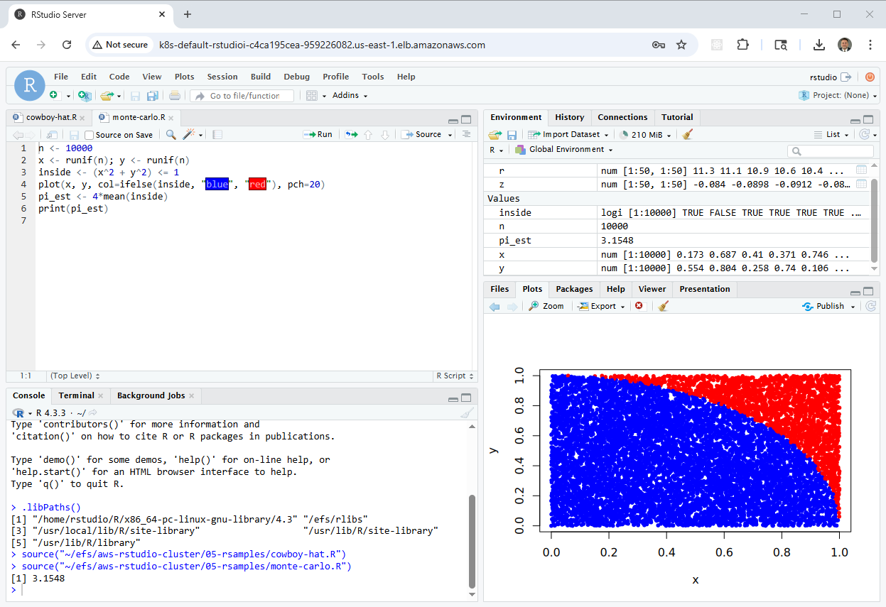
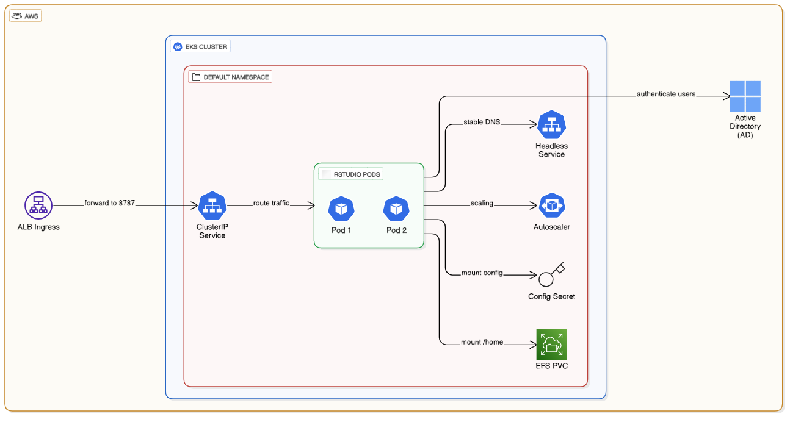
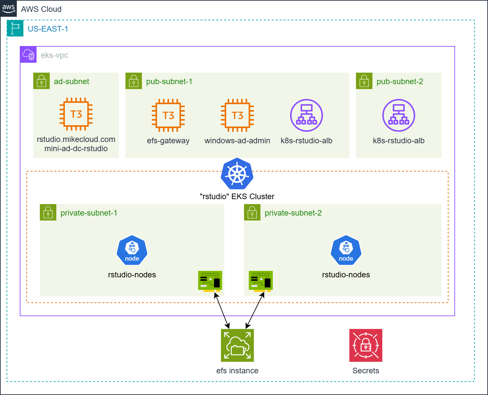
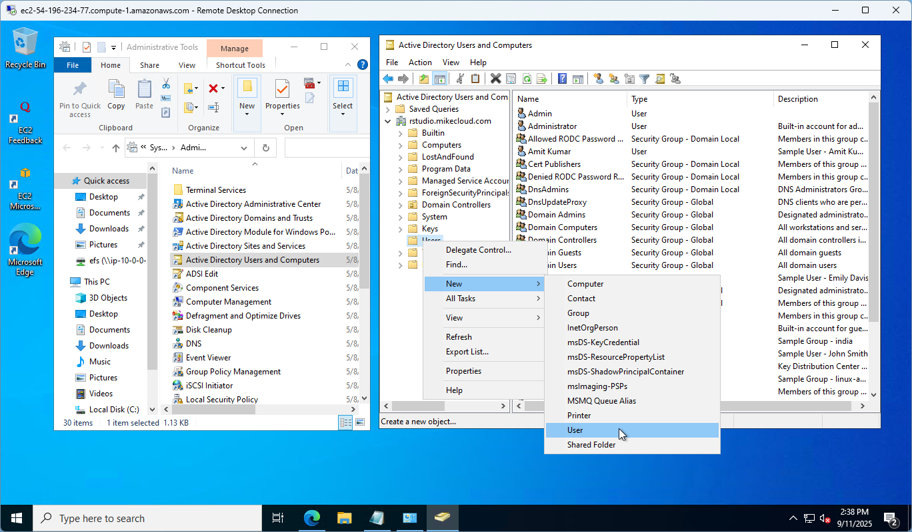

# AWS RStudio Cluster on EKS with Active Directory and EFS Integration

This project builds on both the **AWS Mini Active Directory** and **RStudio on AWS** labs to deliver a **cloud-native, domain-joined RStudio Server cluster** running on **Amazon Elastic Kubernetes Service (EKS)**.  

It uses **Terraform**, **Docker**, and **Kubernetes manifests** to create a fully automated, scalable analytics environment that integrates with **Active Directory authentication** and **Amazon Elastic File System (EFS)** for persistent, shared storage.



Unlike VM-based Auto Scaling Groups, this solution deploys **containerized RStudio Server pods** on EKS that dynamically join the domain and mount **EFS volumes** for user home directories and shared R libraries.  




Key capabilities demonstrated:

1. **EKS-Hosted RStudio Cluster** – RStudio Server (Open Source Edition) runs as containers on an Amazon EKS cluster for elasticity, resilience, and maintainability.  
2. **Active Directory Authentication** – Domain-joined pods authenticate through a Samba-based AD, providing centralized user management.  
3. **EFS-Backed Persistent Storage** – User home directories and shared R package libraries are stored on EFS, ensuring cross-pod consistency and reproducible environments.  
4. **Application Load Balancer (ALB) Ingress** – Provides external HTTPS access with sticky sessions, TLS termination, and DNS integration.  
5. **End-to-End IaC Workflow** – Terraform, Docker, and Helm combine to deliver a modular, reproducible deployment pipeline.

Together, these components form a scalable, domain-aware analytics platform where RStudio users share packages, data, and authentication seamlessly across a fully managed Kubernetes environment.



## Prerequisites

* [An AWS Account](https://aws.amazon.com/console/)
* [Install AWS CLI](https://docs.aws.amazon.com/cli/latest/userguide/getting-started-install.html) 
* [Install Latest Terraform](https://developer.hashicorp.com/terraform/install)
* [Install Docker](https://docs.docker.com/engine/install/)
* [Install kubectl](https://kubernetes.io/docs/tasks/tools/)

If this is your first time watching our content, we recommend starting with this video: [AWS + Terraform: Easy Setup](https://youtu.be/BCMQo0CB9wk). It provides a step-by-step guide to properly configure Terraform and the AWS CLI.


## Download this Repository

```bash
git clone https://github.com/mamonaco1973/aws-rstudio-eks.git
cd aws-rstudio-eks
```

## Build the Code

Run [check_env](check_env.sh) to validate your environment, then run [apply](apply.sh) to provision the infrastructure.

```bash
~/aws-rstudio-eks$ ./apply.sh
NOTE: Running environment validation...
NOTE: Validating that required commands are found in your PATH.
NOTE: aws is found in the current PATH.
NOTE: terraform is found in the current PATH.
NOTE: docker is found in the current PATH.
NOTE: jq is found in the current PATH.
NOTE: All required commands are available.
NOTE: Checking AWS cli connection.
NOTE: Successfully logged into AWS.
NOTE: Building Active Directory instance...
Initializing the backend...
```

### Build Results

When the deployment completes, the following resources are created:

- **Networking:**  
  - A VPC with public and private subnets distributed across multiple Availability Zones  
  - Internet Gateway and NAT Gateway for controlled outbound connectivity  
  - Route tables directing private subnet traffic through the NAT Gateway  
  - DNS resolution provided by the Active Directory domain controller  

- **Security & IAM:**  
  - Security groups for the EKS cluster, ALB ingress, EFS mount targets, and AD servers  
  - IAM roles for service accounts (IRSA) allowing pods to mount EFS volumes and access Secrets Manager  
  - Secrets stored in AWS Secrets Manager for AD administrator and RStudio configuration credentials  

- **Active Directory Domain:**  
  - Deployed via AWS Directory Service or a custom Samba-based “Mini-AD” controller  
  - Provides centralized user authentication and DNS services for the cluster  
  - Integrated with the RStudio pods through SSSD for domain-based logins  

- **Amazon EFS:**  
  - Elastic File System provisioned with mount targets in each private subnet  
  - Security group allowing NFS traffic (TCP/2049) from EKS worker nodes  
  - Used as a persistent backend for both user home directories and shared R package libraries  

- **EKS Cluster & Node Groups:**  
  - Amazon EKS cluster deployed via Terraform, with managed node groups across Availability Zones  
  - Nodes configured with IAM permissions for EFS CSI driver, ALB ingress, and Secrets Manager  
  - Auto Scaling enabled for dynamic pod scheduling and workload elasticity  

- **RStudio Application:**  
  - RStudio Server (Open Source Edition) deployed as a Kubernetes Deployment and Service  
  - ALB Ingress Controller provides external access with TLS termination and sticky sessions  
  - Pods automatically join the AD domain at startup and mount EFS-backed volumes for persistence  
  - Delivers high availability, reproducibility, and domain-based multi-user access  

- **Automation & Validation:**  
  - Terraform modules handle dependency ordering across networking, AD, EKS, and application layers  
  - `apply.sh`, `destroy.sh`, and `validate.sh` scripts automate provisioning and teardown  
  - Validation confirms EKS health, ALB routing, EFS mounts, and AD-based authentication for RStudio users

### Users and Groups

As part of this project, when the domain controller is provisioned, a set of sample **users** and **groups** are automatically created through Terraform-provisioned scripts running on the mini-ad server. These resources are intended for **testing and demonstration purposes**, showcasing how to automate user and group provisioning in a self-managed Active Directory environment.


#### Groups Created

| Group Name    | Group Category | Group Scope | gidNumber |
|---------------|----------------|-------------|-----------|
| rstudio-users  | Security       | Universal   | 10001     |
| india         | Security       | Universal   | 10002     |
| us            | Security       | Universal   | 10003     |
| linux-admins  | Security       | Universal   | 10004     |
| rstudio-admins  | Security       | Universal   | 10005     |

#### Users Created and Group Memberships

| Username | Full Name   | uidNumber | gidNumber | Groups Joined                    |
|----------|-------------|-----------|-----------|-----------------------------------|
| jsmith   | John Smith  | 10001     | 10001     | rstudio-users, us, linux-admins,rstudio-admins    |
| edavis   | Emily Davis | 10002     | 10001     | rstudio-users, us                  |
| rpatel   | Raj Patel   | 10003     | 10001     | rstudio-users, india, linux-admins, rstudio-admins |
| akumar   | Amit Kumar  | 10004     | 10001     | rstudio-users, india               |


#### Understanding `uidNumber` and `gidNumber` for Linux Integration

The **`uidNumber`** (User ID) and **`gidNumber`** (Group ID) attributes are critical when integrating **Active Directory** with **Linux systems**, particularly in environments where **SSSD** ([System Security Services Daemon](https://sssd.io/)) or similar services are used for identity management. These attributes allow Linux hosts to recognize and map Active Directory users and groups into the **POSIX** (Portable Operating System Interface) user and group model.

### Creating a New RStudio User

Follow these steps to provision a new user in the Active Directory domain and validate their access to the RStudio cluster:

1. **Connect to the Domain Controller**  
   - Log into the **`windows-ad-admin`** server via Remote Desktop (RDP).  
   - Use the `rpatel` or `jsmith` credentials that were provisioned during cluster deployment.  

2. **Launch Active Directory Users and Computers (ADUC)**  
   - From the Windows Start menu, open **“Active Directory Users and Computers.”**  
   - Enable **Advanced Features** under the **View** menu. This ensures you can access the extended attribute tabs (e.g., UID/GID mappings).  

3. **Navigate to the Users Organizational Unit (OU)**  
   - In the left-hand tree, expand the domain (e.g., `rstudio.mikecloud.com`).  
   - Select the **Users** OU where all cluster accounts are managed.  

4. **Create a New User Object**  
   - Right-click the Users OU and choose **New → User.**  
   - Provide the following:  
     - **Full Name:** Descriptive user name (e.g., “Mike Cloud”).  
     - **User Logon Name (User Principal Name / UPN):** e.g., `mcloud@rstudio.mikecloud.com`.  
     - **Initial Password:** Set an initial password.



5. **Assign a Unique UID Number**  
   - Open **PowerShell** on the AD server.  
   - Run the script located at:  
     ```powershell
     Z:\efs\aws-rstudio-cluster\06-utils\getNextUID.bat
     ```  
   - This script returns the next available **`uidNumber`** to assign to the new account.  

6. **Configure Advanced Attributes**  
   - In the new user’s **Properties** dialog, open the **Attribute Editor** tab.  
   - Set the following values:  
     - `gidNumber` → **10001** (the shared GID for the `rstudio-users` group).  
     - `uid` → match the user’s AD login ID (e.g., `rpatel`).  
     - `uidNumber` → the unique numeric value returned from `getNextUID.ps1`.  

7. **Add Group Memberships**  
   - Go to the **Member Of** tab.  
   - Add the user to the following groups:  
     - **rstudio-users** → grants standard RStudio access.  
     - **us** (or other geographic/departmental group as applicable).  

8. **Validate User on Linux**  
   - Open an **AWS Systems Manager (SSM)** session to the **`efs-samba-gateway`** instance.  
   - Run the following command to confirm the user’s identity mapping:  
     ```bash
     id mcloud
     ```  
   - Verify that the output shows the correct **UID**, **GID**, and group memberships (e.g., `rstudio-users`).  


9. **Validate RStudio Access**  
   - Open the RStudio cluster’s Application Load Balancer (ALB) URL in a browser (e.g., `https://rstudio-alb-xxxxxx.us-east-1.elb.amazonaws.com`).  
   - Log in with the new AD credentials.  

10. **Verify Permissions**  
   - By default, the new user is **not** a member of the `rstudio-admin` group.  
   - Attempting to install packages into the **shared library path `/efs/rlibs`** should fail with a **“Permission denied”** error.  
   - This confirms the user is restricted to installing packages in their **personal user library** only.  

---

✅ **Note:** If you need the user to have administrative rights (e.g., the ability to install packages into the shared library), add them to the **rstudio-admin** group in addition to `rstudio-users`.
 
### Clean Up Infrastructure  

When you are finished testing, you can remove all provisioned resources with:  

```bash
./destroy.sh
```

This will use Terraform to delete the VPC, EC2 instances, IAM roles, security groups, and any other infrastructure created by the project. Secrets stored in AWS Secrets Manager will also be deleted unless retention policies are configured.