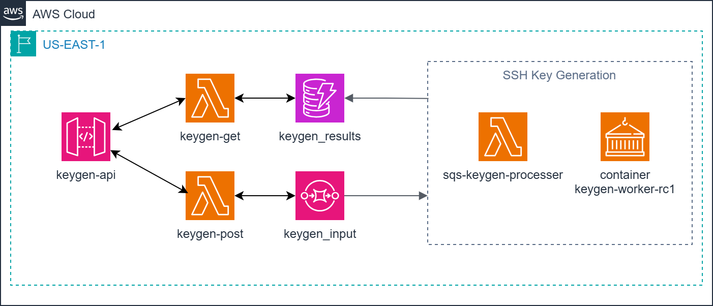

# AWS SSH KeyGen Microservice with SQS, Lambda, and API Gateway

This project delivers a fully automated **serverless SSH key generation service** on AWS, powered by **Amazon Simple Queue Service (SQS)**, **AWS Lambda**, and **API Gateway**.  

It uses **Terraform**, **Docker**, and **Python (boto3 + cryptography)** to build a **message-driven key generation pipeline** that asynchronously handles SSH keypair requests and responses through SQS queues — all without managing any EC2 instances.


Unlike traditional compute-based key generation systems, this design uses a **stateless microservice** architecture where Lambda functions process queued requests on demand, ensuring zero idle cost and automatic scaling.

Key capabilities demonstrated:

1. **Serverless Key Generation Pipeline** – Implements a fully event-driven workflow using SQS request/response queues and a Python Lambda worker.  
2. **Asynchronous Processing** – Clients submit key generation jobs through an API Gateway endpoint and poll for results via a unique `request_id`.  
3. **Secure Key Management** – All private/public keypairs are generated in-memory and returned base64-encoded without ever persisting to disk.  
4. **Infrastructure as Code (IaC)** – Terraform modules provision SQS queues, ECR repositories, Lambda functions, API Gateway endpoints, and S3 web hosting automatically.  
5. **Static Web Client** – A simple HTML frontend lets users trigger key generation requests directly from a browser using the deployed API endpoints.  

Together, these components form a **lightweight, fully serverless DevOps utility** for on-demand SSH key generation — ideal for integration with CI/CD workflows, sandbox environments, or short-lived development accounts.



## Prerequisites

* [An AWS Account](https://aws.amazon.com/console/)
* [Install AWS CLI](https://docs.aws.amazon.com/cli/latest/userguide/getting-started-install.html)
* [Install Terraform](https://developer.hashicorp.com/terraform/install)
* [Install Docker](https://docs.docker.com/engine/install)

If this is your first time following along, we recommend starting with this video:  
**[AWS + Terraform: Easy Setup](https://youtu.be/BCMQo0CB9wk)** – it walks through configuring your AWS credentials, Terraform backend, and CLI environment.

## Download this Repository

```bash
git clone https://github.com/mamonaco1973/aws-sqs-keygen.git
cd aws-sqs-keygen
```

## Build the Code

Run [check_env](check_env.sh) to validate your environment, then run [apply](apply.sh) to provision the infrastructure.

```bash
~/aws-sqs-keygen$ ./apply.sh
NOTE: Running environment validation...
NOTE: Validating that required commands are found in your PATH.
NOTE: aws is found in the current PATH.
NOTE: terraform is found in the current PATH.
NOTE: docker is found in the current PATH.
NOTE: jq is found in the current PATH.
NOTE: All required commands are available.
NOTE: Checking AWS cli connection.
NOTE: Successfully logged into AWS.
NOTE: Building Active Directory instance...
Initializing the backend...
```

### Build Results

When the deployment completes, the following resources are created:

- **Core Infrastructure:**  
  - Fully serverless architecture—no EC2 instances or VPC networking required  
  - Terraform-managed provisioning of SQS, Lambda, API Gateway, ECR, and S3 resources  
  - Event-driven message pipeline enabling asynchronous SSH key generation requests  

- **Security & IAM:**  
  - IAM roles for Lambda execution with scoped permissions for SQS, CloudWatch, and Secrets Manager  
  - Optional encryption of SQS queues using AWS-managed KMS keys for data-in-transit protection  
  - Secure handling of generated SSH keys entirely in-memory—no local file storage or persistence  

- **Amazon SQS Queues:**  
  - Dedicated request and response queues (`keygen-request` and `keygen-response`)  
  - Request queue receives incoming SSH key generation messages from API Gateway or CLI clients  
  - Response queue delivers completed results containing the base64-encoded public and private keys  

- **AWS Lambda Function:**  
  - Python-based Lambda built from a custom Docker image hosted in Amazon ECR  
  - Asynchronously consumes requests from the SQS queue, generates SSH keypairs, and posts responses  
  - Supports RSA-2048, RSA-4096, and Ed25519 key types configurable through API payload parameters  

- **Amazon API Gateway:**  
  - HTTP API exposing `/request` and `/result/{request_id}` endpoints  
  - Integrates directly with the Lambda function to submit and query key generation jobs  
  - Enables stateless, public access for client applications or browser-based web requests  

- **Amazon ECR:**  
  - Private ECR repository (`ssh-keygen`) for the Lambda container image  
  - Automated vulnerability scanning enabled for enhanced security visibility  
  - Used as the Lambda image source during Terraform deployment  

- **Static Web Application (S3):**  
  - S3 bucket configured for static website hosting with public read access through a managed policy  
  - `index.html` provides a simple frontend allowing users to select key type and initiate generation requests  
  - Connected to API Gateway endpoints defined by Terraform outputs  

- **Automation & Validation:**  
  - `apply.sh`, `destroy.sh`, and `check_env.sh` scripts automate provisioning, teardown, and environment validation  
  - `validate.sh` performs end-to-end service verification by invoking the API, polling for results, and confirming keypair output  
  - End-to-end workflow requires only AWS credentials, Docker, Terraform, and jq to execute  

Together, these resources form a **serverless, event-driven SSH KeyGen pipeline** that demonstrates modern AWS microservice design principles—scalable, cost-efficient, and fully managed from infrastructure to code.


